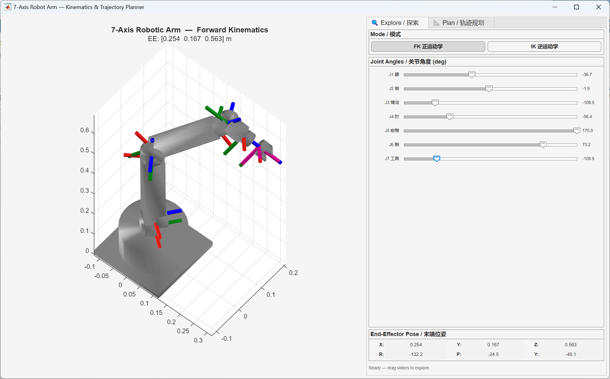
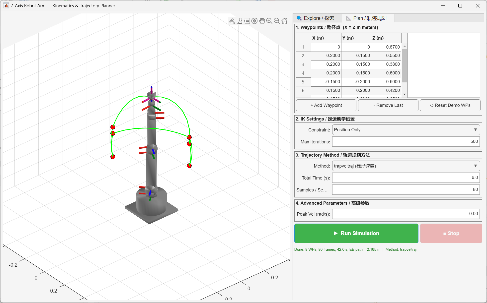
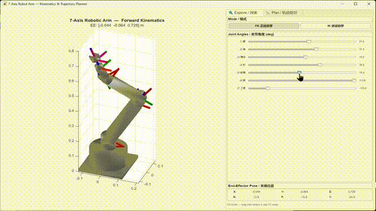
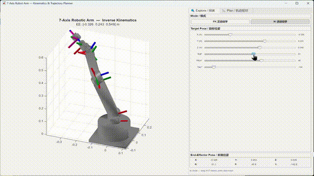
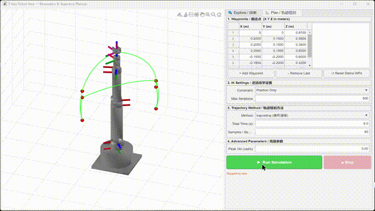
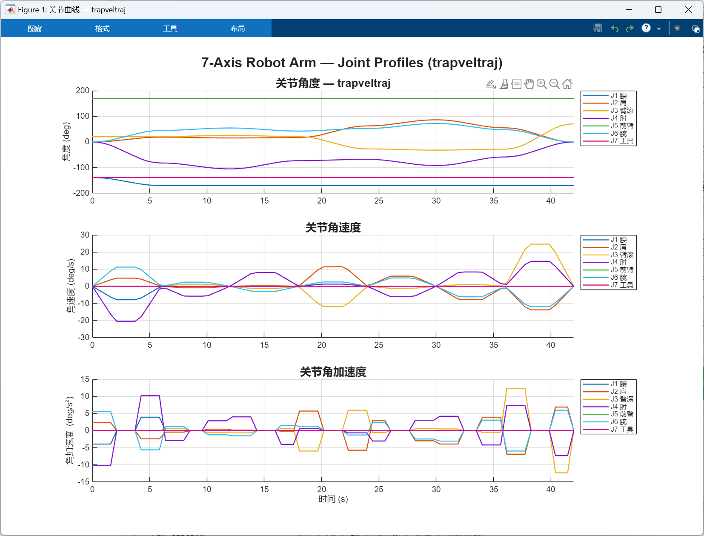
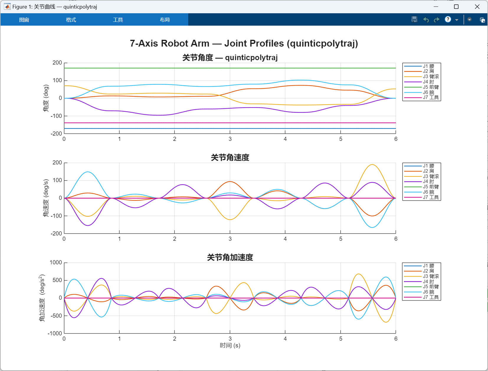

# 6-Axis Robotic Arm

基于 MATLAB Robotics System Toolbox 的六自由度机械臂运动学仿真与轨迹规划项目。

采用 Z-Y-Y-Z-Y-Z 全旋转关节串联构型，关节布局为：腰→肩→肘→前臂横滚→腕→工具，最大伸展距离约 0.87 m。

## 界面

| 探索（FK/IK 滑块） | 轨迹规划（路径点 + 动画） |
|:---:|:---:|
|  |  |

## 功能演示

| 正运动学 | 逆运动学 | 轨迹规划 |
|:---:|:---:|:---:|
|  |  |  |

## 快速开始

```matlab
robot_arm_gui      % 主界面
demo_simulation    % pick-and-place 演示脚本
run_tests          % 基础测试
```

需要 **MATLAB R2020b+** 和 **Robotics System Toolbox**。

## 文件结构

```
├── build_6axis_arm.m             机械臂刚体树模型
├── robot_arm_gui.m              【主程序】探索 + 规划合一界面
├── interactive_robot_gui.m       FK/IK 滑块交互（已合并入主程序）
├── trajectory_planner_gui.m      轨迹规划独立版（已合并入主程序）
├── demo_simulation.m             pick-and-place 动画脚本
├── run_tests.m                   模型 / FK / IK / 雅可比 / 碰撞 / 轨迹测试
└── res/                          截图 & GIF
    ├── png/
    └── gif/
```

## 机械臂参数

| 项目 | 值 |
|------|-----|
| 自由度 | 6（全旋转关节） |
| 关节布局 | Z-Y-Y-Z-Y-Z |
| 总伸展 | ≈ 0.87 m |
| 关节范围 | ±120° ~ ±175° |
| 重力 | [0 0 -9.81] |

## 轨迹规划方法

| 方法 | 说明 |
|------|------|
| `trapveltraj` | 梯形速度剖面，输出速度/加速度 |
| `cubicpolytraj` | 三次多项式，C² 连续 |
| `quinticpolytraj` | 五次多项式，C⁴ 连续 |
| `bsplinepolytraj` | B 样条插值 |

运行规划后可弹出各关节的角度/角速度/角加速度曲线：

| 梯形速度 | 五次多项式 |
|:---:|:---:|
|  |  |
